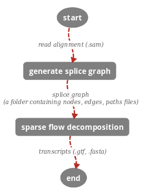
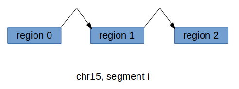

***

### Topics

<a href='#intro'> Introduction </a>

<a href='#workflow'> Work Flow </a>

<a href='#install'> Installation </a>

<a href='#req'> Software & Hardware Requirements </a>

<a href='#usage'> Usage </a>

   - <a href='#cmd1'> python refShannon.py --batch -i sam_file -g genome_file </a> <a href='#eg1'> [Example] </a>

    - <a href='#cmd2'> python refShannon.py --batch -I chrs_dir -g multi_genome_file </a> <a href='#eg2'> [Example] </a>

    - <a href='#cmd3'>python refShannon.py --batch -I chrs_dir -G genome_dir </a> <a href='#eg3'> [Example] </a>

<a href='#sg'> Splice Graph </a>

<a href='#history'> History </a>

***

### Introduction 

RefShannon is a reference based transcriptome assembler, which is able to reconstruct RNA transcripts from read alignment. It is based on a sparse flow decomposition algorithm. This software is developed by [Shunfu Mao](shunfu@uw.edu) and [Sreeram Kannan](ksreeram@uw.edu) at University of Washington.

### Work Flow 

RefShannon can take read alignment (.sam) as input, generate splice graph and then use a sparse flow algorithm to reconstruct RNA transcripts in both gtf and fasta formats, as shown below.

RefShannon Core

***

### Installation 

RefShannon is written in Python. 

You can download code [here](https://github.com/shunfumao/RefShannon).

Once you extract downloaded .py files to some folder (e.g. /home/usr/code_folder/), you can run RefShannon directly under this folder.

***

### Software & Hardware Requirements 

External packages & softwares RefShannon depends on are:

Dependent packages & softwares | Purpose
---- | ----
python cvxopt package | used in transcript reconstruction

Hardware requirements:

A lab server w/ 20+ CPU cores and 100+G memory is recommended.

***

### Usage 

We describe core functions (e.g. reconstruct transcripts from read alignment) of RefShannon here. There are some other usages, and interested users can find them from source code files (especially refShannon.py). 

#### Command 1
This is the core function of RefShannon. It reconstructs transcripts from a read alignment file. The intermediate result of splice graph files may also be kept.

~~~
python refShannon.py --batch -i sam_file -g genome_file [-O out_dir] [-paired] [-target chr] [-N nJobs] [-clear] [-F F_val]
~~~
argument | description
---- | ----
-i sam_file | required. specifies the read alignment file to use. sam_file should be in .sam format and is absolute path. It can be obtained by aligning single end or pair end reads onto single genome (e.g. chr15.fa) or multi genome (e.g. hg19.fa, containing chr1, chr15 etc). We recomend STAR aligner, and for paire-end reads, mate pair alignments are adjacent to each other.
-g genome_file | required. specifies the genome file to use. genome_file should be in fasta format and is absolute path. It can be single genome or multi genome.
-O out_dir | optional. default is directory of sam_file. specifies the absolute path of output directory. Outputs include (1) splice graph, stored in out_dir/intermediate/ (2) transcripts files (reconstructed.fasta, reconstructed.gtf), stored in out_dir/algo_output/.
-paired | needed if the sam_file is generated from pair end reads.
-target chr | needed if (1) the sam_file is generated from a multi genome file or (2) the genome_file is multi genome or (3) you hope the output gtf file indicates the target chromosome information. For example, if you want to reconstruct transcripts from chr15 (e.g. human chromosome 15), "-target chr15" is needed.
-N nJobs | optional. defaut is nJobs=1. specifies number of cores to use in parallel. 
-clear | optional. when used, intermediate files (e.g. those related to splice graph) will be deleted.
-F F_val | optional. Default is 0. controls sensitivity and specifity trade-off. F is in [0,1] with 0 corresponding to max sensitivity and 1 to min false positive.

##### Example 

You have pair end reads reads_1.fq and reads_2.fq aligned onto genome chr 15 (path1/chr15.fa), and get sam_file (path2/hits.sam).

By running
`python refShannon.py --batch -i path2/hits.sam -g path1/chr15.fa -paired -target chr15 -N 20`,

you will have (1) splice graph files stored at `path2/intermediate/` and (2) transcripts file stored at `path2/algo_output/reconstructed.fasta` and `path2/algo_output/reconstructed.gtf`.

#### Command 2
This command can process multi alignment files (1 alignment file corresponds to 1 chromosome) together.

~~~
python refShannon.py --batch -I chrs_dir -g multi_genome_file [-O out_dir] [-chrs chr_a[,chr_b,...]] [-paired] [-N nJobs] [-clear] [-F F_val]

~~~

argument | description
---- | ----
-I chrs_dir | required. specifies absolute path of directory where read alignments are stored. In particular, read alignment file for chromosome i should be stored as chrs_dir/chri/hits.sam.  For example, you align reads to 3 chromosomes chr1, chr12 and chr15, then they should be stored as chrs_dir/chr1/hits.sam, chrs_dir/chr12/hits.sam and chrs_dir/chr15/hits.sam respectively. We can use RefShannon's split.py file to generate chrs_dir from a multi_genome alignment file (e.g. `python split.py -O chrs_dir -i multi_genome_sam_file`)
-g multi_genome_file | required. specifies the multi genome file to use. multi_genome_file should be in fasta format and is absolute path. This file should contain all the chromosomes that the alignment files are generated from.
-O out_dir | optional. default is chrs_dir. specifies the absolute path of output directory. For alignment files at chrs_dir/chri/hits.sam, the relevant outputs of (1) splice graph and (2) transcripts files will be stored at (1) out_dir/chri/intermediate/ and (2) out_dir/chri/algo_output/ respectively.
-chrs chr_a,chr_b,... | optional. specify target chromosomes. For example, there're 3 alignments at chrs_dir/chr1/hits.sam, chrs_dir/chr12/hits.sam and chrs_dir/chr15/hits.sam, if you specify "-chrs chr1,chr15", then chr12 will not be processed. default is all chromosomes under chrs_dir will be processed. chromosomes (chr_a,chr_b etc) are seperted by comma and shall not contain spaces or tabs.
-paired | (same as in command 1)
-N nJobs | (same as in command 1)
-clear | (same as in command 1)
-F F_val | (same as in command 1)

##### Example 

You have pair end reads reads_1.fq and reads_2.fq aligned onto human genome hg19 (path1/hg19.fa) which contains e.g. chr1, chr12, chr15 etc, and get sam_file (path2/hits.sam). This sam_file shall contain muli genome info e.g. chr1, chr12, chr15 etc.

By running
`python split.py -O path3/ -i path2/hits.sam`,

You split `path2/hits.sam` into `path3/chr1/hits.sam`, `path3/chr12/hits.sam`, `path3/chr15/hits.sam` etc. Each `path3/chr_i/hits.sam` contains only alignment information related to `chr_i`.

Then by running
`python refShannon.py --batch -I path3/ -g path1/hg19.fa -O path4/ -chrs chr1,chr15 -paired -N 20`

you will have (1) splice graph files stored at `path4/chr_i/intermediate/` and (2) transcripts file stored at `path4/chr_i/algo_output/reconstructed.fasta` and `path4/chr_i/algo_output/reconstructed.gtf` for `chr_i in {chr1, chr15}`.

#### Command 3
This command can also process multi alignment files (1 alignment file corresponds to 1 chromosome) together.

The only difference from command 2 is it uses "-G genome_dir" instead of  "-g multi_genome_file". 

~~~
python refShannon.py --batch -I chrs_dir -G genome_dir [-O out_dir] [-chrs chr_a[,chr_b,...]] [-paired] [-N nJobs] [-clear] [-F F_val]
~~~

argument | description
---- | ----
-G genome_dir | required. specifies the absolute path of the genome directory. This directory should contain all single genome files (in fasta format) that the alignment files are generated from (e.g. genome_dir/chr1.fa, genome_dir/chr12.fa genome_dir/chr15.fa ...). We can use RefShannon's util.py file (`python util.py --splitMultiFasta -i multi_genome_file -O genome_dir`) to generate genome_dir from multi_genome_file.
(other args) | see command 2

##### Example 

You have pair end reads reads_1.fq and reads_2.fq aligned onto human genome hg19 (path1/hg19.fa) which contains e.g. chr1, chr12, chr15 etc, and get sam_file (path2/hits.sam). This sam_file shall contain muli genome info e.g. chr1, chr12, chr15 etc.

By running
`python util.py --splitMultiFasta -i path1/hg19.fa -O path1/`,
`path1/chr1.fa`, `path1/chr12.fa`, `path1/chr15.fa` etc will be generated from `path1/hg19.fa`.

By running
`python split.py -O path3/ -i path2/hits.sam`,

You split `path2/hits.sam` into `path3/chr1/hits.sam`, `path3/chr12/hits.sam`, `path3/chr15/hits.sam` etc. Each `path3/chr_i/hits.sam` contains only alignment information related to `chr_i`.

Then by running
`python refShannon.py --batch -I path3/ -G path1/ -O path4/ -chrs chr1,chr15 -paired -N 20`

you will have (1) splice graph files stored at `path4/chr_i/intermediate/` and (2) transcripts file stored at `path4/chr_i/algo_output/reconstructed.fasta` and `path4/chr_i/algo_output/reconstructed.gtf` for `chr_i in {chr1, chr15}`.

***

### Splice Graph 

Based on RefShannon, a chromosome (e.g. chr15) can contain many segments (e.g. similar as gene). Each segment is a maximally connected component of certain regions (e.g. similar as exon) on this chromosome. Two regions are connected if there're reads going through them.

One segment corresponds to one splice grap, and are mainly described by nodes, edges and paths files. For example, below is an illustrated figure of segment i on chromosome 15. 

Splice Graph

After running RefShannon, you can find nodesi.txt, edgesi.txt and pathsi.txt for segment i from path/to/chr15/intermediate. Their formats are:

File | Formats
---- | ----
nodesi.txt | column 1: id of single region (or node)
                 | column 2: sequence of region
                 | column 3: average read coverage of region
                 | column 4: length of sequence of region
                 | column 5: genome start position of region (0-based, inclusive)
                 | column 6: genome end position of region (0-based, inclusive)
edgesi.txt | column 1: start region id
                 | column 2: end region id
                 | column 3: overlap between start and end regions (currently always 0)
                 | column 4: weight (e.g. number of reads going through from start region toward end region) of edge
                 | column 5: normalization (currently always 1)              
pathsi.txt | each line is a sequence of region ids, indicating there's a path (e.g. transcript) going through these regions

***

### History 

2017.03.20 - slightly revised to include F_val usage.

2016.10.02 - code wrapped up and initial manual finished.
